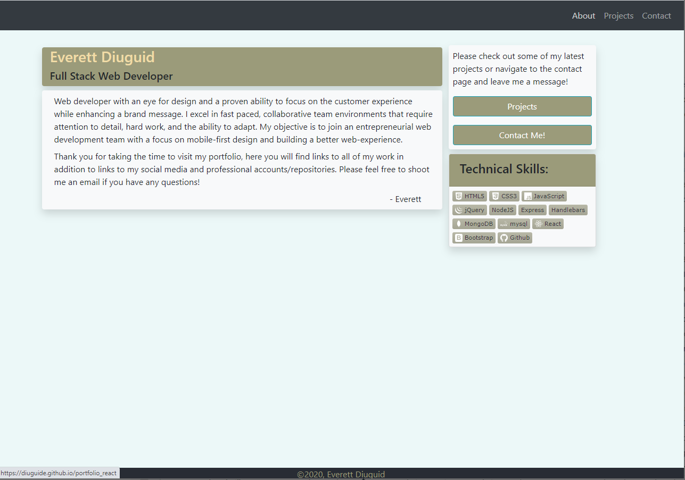
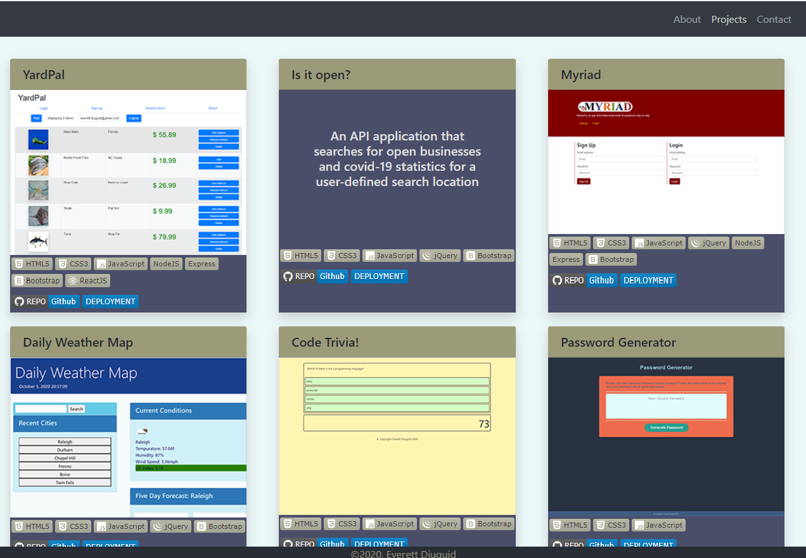
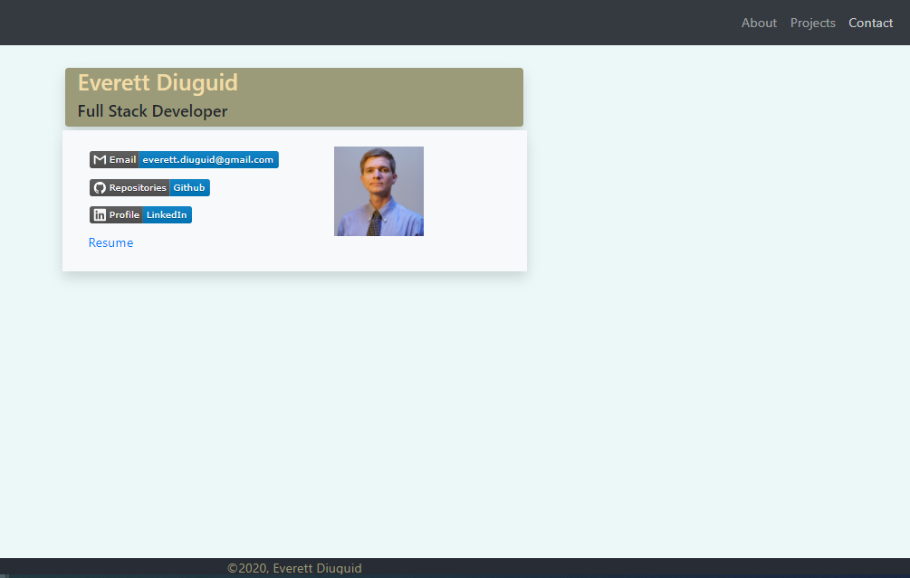

# [React Portfolio](https://diuguide.github.io/portfolio_react/)


[](LICENSE)

- This is a reactJS based application highlighting my Web Development work to date.  This includes a brief introduction, technical skills, most recent projects, and contact info.  Please reach out to me @ ```everett.diuguid@gmail.com``` if you have any questions!  

<a href="https://diuguide.github.io/portfolio_react/">



</a>


- [Installation](#installation)
- [Usage](#usage)
- [Contributors](#contributors)
- [License](#license)

## Installation

- In order to access this application, all you need to do is navigate to <https://diuguide.github.io/portfolio_react/>, or click the hyperlink or picture of the application above and you will be directed to the website.

[back to Table of Contents](#table-of-contents)

## Usage

- User will navigate to the website, clicking preferred links, there is a resume attached to the contact page along with a brief introduction, projects and contact information.

[back to Table of Contents](#table-of-contents)

## Contributors

- [Everett Diuguid](https://github.com/diuguide/)

[back to Table of Contents](#table-of-contents)

## License

[MIT](LICENSE) copyright (c) 2020 Everett Diuguid

[back to Table of Contents](#table-of-contents)
